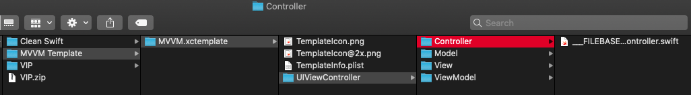

# Xcode Template
> XCode Template is a tool for creating code snippets to give you a better starting point to achieve your goal

## Why Template come into the picture

- Single module/feature may require multiple classes, files, structs, protocols and some boiler plate code. Hence, it takes more time to create a skeleton for single module. This process is pretty much the same each time. For example – in the MVVM pattern, to create a Login module we need to create few folders and at least 4-5 class-files which contain some boiler plate code
- To solve this problem, we could automate this task and create entire skeleton on single click. To achieve this, we have to create templates as per the project requirement

## Why to use a template

- Speed up project development and time saving (developers could more focus on business logic)
- Uniformly project development
- Enforcing best practices to the team members

## How to create a custom template

#### Copy default xcode template
- Xcode keeps its default templates in a dedicated folder that you can find here:
/Applications/Xcode.app/Contents/Developer/Library/Xcode/Templates/File Templates/Source

- Copy the "Swift File.xctemplate" folder and paste it at "~/Library/Developer/Xcode/Templates/File Templates/Custom"

OR

 - In your terminal, run these commands:

mkdir -p ~/Library/Developer/Xcode/Templates/File Templates

cp -R /Applications/Xcode.app/Contents/Developer/Library/Xcode/Templates/File Templates/Source/Swift\ File.xctemplate ~/Library/Developer/Xcode/Templates/File Templates/Custom/

Here, we are using xcode default template for the reference. 

#### Customize a template as per your requirement
- Let's consider, we are creating a template for MVVM architecture. You can create your own custom template as per the project architecture.
Modify and rename the custom folder. Refer below screenshots
 
 
 

- Write boiler plate code for all the files
eg. Refer viewcontroller file as given in below sccreenshot

- Modify .plist file
Add Identifier, name, description etc inside an Option node in the plist file. Option node should contain items for all the files.
Please refer below screenshot and my .plist file which you will get from my repository. 

##### Plist is a xml file that contains some important keys which are described as below:

- Kind :-  Its own particular value that is required for File Templates. The value of this key is always: Xcode.IDEFoundation.TextSubstituionFileTempalteKind

- Description :- A brief description of the template file

- DefaultCompletionName :-  The default name of file (without extension)

- Options :- This key allows us to configure a sort of “Select…” option that will appear in the file creation dialog window of Xcode once we select the template
Below are the options node field.

- Identifier : used to uniquely identify options. You can use it for creating references for using in other options or template file

- Default : Scene name and identifier

- Description : brief description of the option. You can see the text when the mouse hovers over it

- Name: Text is shown on the left side of the control  when file creation dialog window display in Xcode

- Required : If a Required option does not have a valid value the Next button on dialog window will be unavailable

Now your MVVM template is ready to consume.

## How to use a template in Xcode

 If you have already integrated template at "~/Library/Developer/Xcode/Templates/File Templates/Custom", ignore below step.

- Copy the "Templates folder" and paste it at "~/Library/Developer/Xcode/Templates/File Templates/Custom"

- Open your project -> Create new file -> choose MVVM 

- You get entire structure in your project. You might notice, folders created are the resource folders (which represented in blue color). But we need the group folders (in yellow color). Hence delete -> Remove reference of all those folders. Go to Add files to "projectName" -> choose all those folders -> add

## Ready to use template provided with this project

- I have created an entire template with boiler plate code for VIP architecture. You can consume it from here
- I also have created a template for MVVM architecture. So that you can enrich the template with your own boiler plate code

