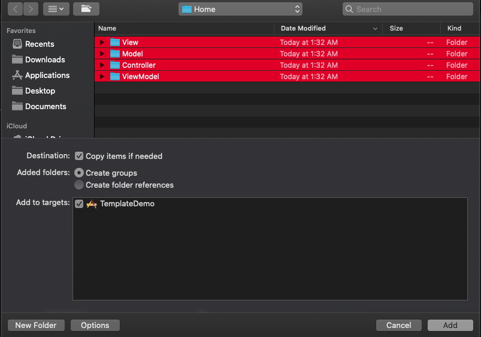

# Xcode Templates
> XCode Templates is a tool for creating code snippets to give you a better starting point to achieve your goal

## Why Templates come into the picture

- Single module/feature may require multiple classes, files, structs, protocols and some boiler plate code. Heance, it takes more time to create a skelaton for single module. This process is pretty much the same each time. For example – in the MVVM pattern, to create a Login module we need to create few folders and at least 4-5 class-files which contain some boiler plate code
- To solve this problem, we could automate this task and create entire skelaton on single click. To achive this, we have to create templates as per the project requirement

## Why to use a template

- Speed up project development and time saving (developers could more focus on business logic)
- Uniformly project development
- Enforcing best practices to the team members

## How to create a custom template

#### Copy default xcode template
- Xcode keeps its default templates in a dedicated folder that you can find here:
/Applications/Xcode.app/Contents/Developer/Library/Xcode/Templates/File Templates/Source

- Copy the "Swift File.xctemplate" folder and paste it at "~/Library/Developer/Xcode/Templates/File Templates/Custom"

OR

 - In your terminal, run these commands:

mkdir -p ~/Library/Developer/Xcode/Templates/File Templates

cp -R /Applications/Xcode.app/Contents/Developer/Library/Xcode/Templates/File Templates/Source/Swift\ File.xctemplate ~/Library/Developer/Xcode/Templates/File Templates/Custom/

Here, we are using xcode default template for the reference. 

#### Customize a template as per your requirement
- Let's consider we are creating a template for MVVM architecture. You can create your own custom template as per the project architecture.
Modify and rename the custom folder. Refer below screenshots
 
 
 

- Write boiler plate code for all the files
eg. Refer viewcontroller file as given in below sccreenshot

- Modify .plist file
Add Identifier, name, description etc inside an Option node in the plist file. Option node should contain items for all the files.
Please refer below screenshot and my .plist file which you will get from my repository. 

Now your MVVM template is ready to consume.

## How to use a template in Xcode

 If you have already integrated template at "~/Library/Developer/Xcode/Templates/File Templates/Custom", ignore below step.

- Copy the "Templates folder" and paste it at "~/Library/Developer/Xcode/Templates/File Templates/Custom"

- Open your project -> Create new file -> choose MVVM 

- You get entire structure in your project. You might notice, folders created are the resorce folders (which represented in blue color). But we need the group folders (in yellow color). Hence delete -> Remove refernce of all those folders. Go to Add files to "projectName" -> choose all those folders -> add

## Ready to use template provided with this project

- I have created an entire template with boiler plate code for VIP architecture. You can consume it from here

